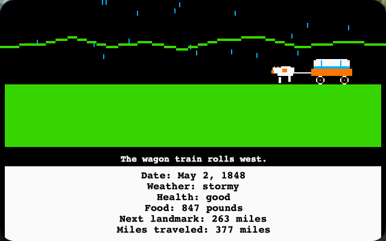
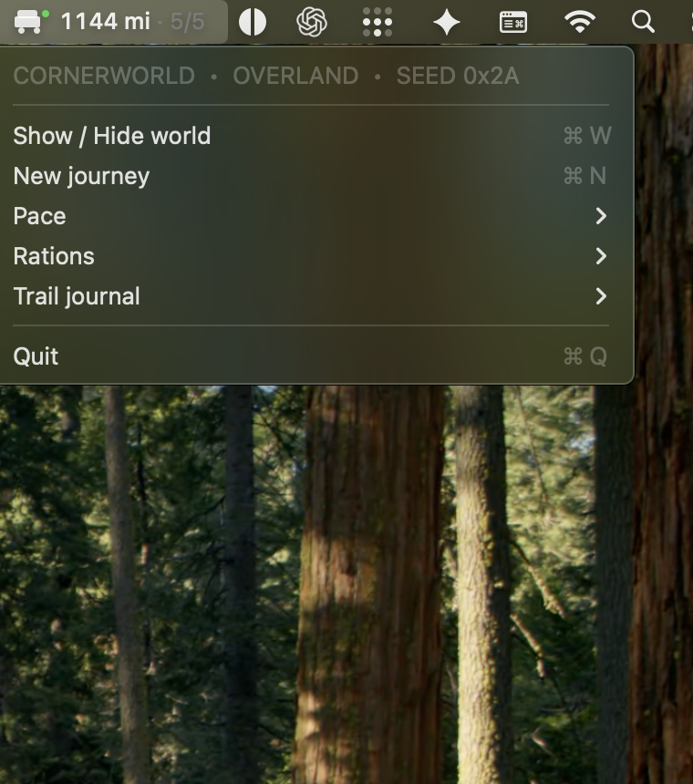

# Cornerworld

**Small worlds that live quietly at the edge of your desktop.**

Cornerworld is an open-source macOS experiment in ambient simulation: a
persistent 320×200 world sits in the corner of the screen, advances at its own
pace, and exposes just enough control through the menu bar. It is designed to
feel present without asking to become the center of attention.



Version 1.0 ships with **Overland**, a deterministic westward journey about
distance, weather, supplies, health, and attrition. Overland is the first world,
not the limit of the idea. A farm, lighthouse, railway, expedition, or other
slow-running scenario could eventually inhabit the same desktop form.

## What is here in 1.0

- A borderless SpriteKit world pinned to a macOS desktop corner.
- A compact menu-bar readout for mileage and surviving travelers.
- Deterministic journeys that can be reproduced from a seed.
- Persistent weather fronts, terrain, landmarks, illness, trade, repairs, and
  supply opportunities.
- Meaningful pace and ration choices.
- A trail journal and end-of-journey memorial summary.
- A terminal runner for development and simulation checks.



## Requirements

- macOS 13 or later
- Swift 6 toolchain (Xcode 16 or a compatible Swift installation)

Cornerworld 1.0 is a source-first release. It does not yet include a signed or
notarized `.app` bundle, an installer, or launch-at-login support.

## Run the desktop world

```sh
git clone https://github.com/stoicpickle/cornerworld.git
cd cornerworld
swift run cornerworld
```

The app appears in the upper-left corner and adds a wagon readout to the menu
bar. Use that menu to show or hide the world, start a new journey, change pace
or rations, and read recent journal entries.

For a reproducible or accelerated development run:

```sh
swift run cornerworld --seed 7
swift run cornerworld --seed 7 --fast
```

## Choices

### Pace

Pace changes the terrain's base daily mileage:

| Setting | Daily adjustment |
| --- | ---: |
| Steady | +3 miles |
| Moderate | Standard terrain rate |
| Slow | −2 miles |
| Very slow | −6 miles |

### Rations

Rations trade food reserves for daily health:

| Setting | Food per traveler | Daily health |
| --- | ---: | ---: |
| Filling | 3 lbs | +2 |
| Meager | 2 lbs | 0 |
| Bare bones | 1 lb | −2 |

Running out of food overrides the ration setting with a larger health penalty.
Illness and harsh weather stack with these effects.

## Run the terminal simulation

```sh
swift run cornerworld-cli --seed 7
swift run cornerworld-cli --help
```

## Validate a checkout

```sh
swift test
swift test -c release
swift build -c release
```

## Project structure

- `GameCore` owns deterministic simulation state, daily events, and journey
  outcomes.
- `TrailApp` owns the macOS status item and fixed-resolution SpriteKit scene.
- `GameCLI` provides a terminal presentation for seeded runs.

Cornerworld deliberately remains a single-scenario application in 1.0. The
shared scenario interface will be extracted after a second world supplies a
real design case; the project does not claim to have a plugin system today.
See [the roadmap](docs/ROADMAP.md) for the intended direction.

## Contributing

Ideas, bug reports, documentation fixes, accessibility improvements, new event
tests, and carefully scoped pull requests are welcome. Please read
[CONTRIBUTING.md](CONTRIBUTING.md) before starting a larger change.

For a new scenario, begin with a proposal describing its slow-running loop,
corner-scale visual language, meaningful choices, and what it would teach us
about the future shared scenario boundary.

## Independence and historical scope

Cornerworld is an independent project and is not affiliated with or endorsed by
the creators or publishers of *The Oregon Trail*. It contains no copied game
code or original game assets. Overland is a compact fictional simulation, not a
comprehensive representation of westward migration or Indigenous history.
See the [historical-content note](docs/HISTORICAL_NOTE.md) for sources, framing,
and how to suggest corrections.

## License

Cornerworld is available under the [MIT License](LICENSE).
