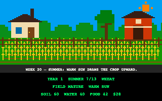
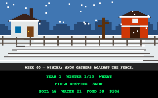
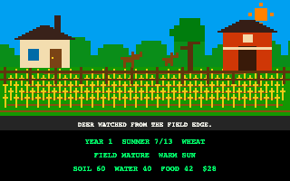
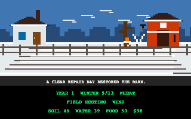
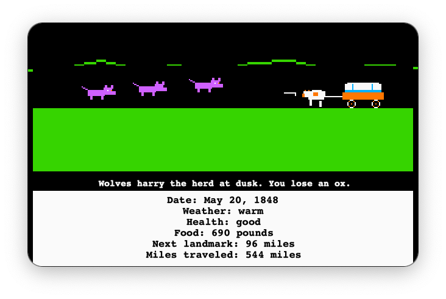
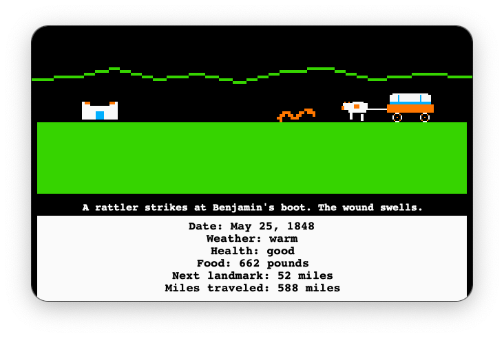

# Cornerworld

**Small worlds that live quietly at the edge of your desktop.**

Cornerworld is an open-source macOS experiment in ambient simulation: a
persistent 320×200 world sits in the corner of the screen, advances at its own
pace, and exposes just enough control through the menu bar. It is designed to
feel present without asking to become the center of attention.

Drag anywhere inside a world to move its borderless window to another part of
the desktop.


Version 1.1 ships with **Overland**, a deterministic westward journey about
distance, weather, supplies, health, and attrition. Overland is the first world,
not the limit of the idea. A lighthouse, railway, expedition, or other
slow-running scenario could eventually join it in the same desktop form.

The current development build also includes **Farm**, Cornerworld's first
experiment with a second world: a deterministic year of planting, weather,
harvest, and winter pressure rendered as a fixed seasonal homestead.

It now also includes an early **Canopy** world: vines steadily climb through a
moonlit jungle while rain, flowers, birds, and an original swinging wanderer
interrupt the growth. Canopy is deliberately open-ended and low-intervention,
closer to a living desktop animation than a campaign with a win state.

| Farm in summer | Farm in winter |
| --- | --- |
|  |  |

Farm's weekly story now appears in the field itself, including wildlife, crop
trouble, neighbor visits, repair work, harvest, and the year-end result.

| Deer at the field edge | A winter repair day |
| --- | --- |
|  |  |

Overland now gives important events their own deterministic pixel-art
vignettes instead of reporting every encounter through text alone.

| Wolves harry the herd | A rattler strikes |
| --- | --- |
|  |  |

## What is here in 1.1

- A borderless SpriteKit world pinned to a macOS desktop corner.
- A compact menu-bar readout for mileage and surviving travelers.
- Deterministic journeys that can be reproduced from a seed.
- Persistent weather fronts, terrain, landmarks, illness, trade, repairs, and
  supply opportunities.
- Deterministic pixel-art vignettes for crossings, hunts, breakdowns, encounters,
  weather, and quiet trail moments.
- Meaningful pace and ration choices.
- A trail journal and end-of-journey memorial summary.
- A terminal runner for development and simulation checks.

## Requirements

- macOS 13 or later
- Swift 6 toolchain (Xcode 16 or a compatible Swift installation)

Cornerworld 1.1 is a source-first release. It does not yet include a signed or
notarized `.app` bundle, an installer, or launch-at-login support.

## Run the desktop world

```sh
git clone https://github.com/stoicpickle/cornerworld.git
cd cornerworld
swift run cornerworld
```

The app appears in the upper-left corner and adds a wagon readout to the menu
bar. Use that menu to show or hide the world, start a new journey, change pace
or rations, and read recent journal entries.

For a reproducible or accelerated development run:

```sh
swift run cornerworld --seed 7
swift run cornerworld --seed 7 --fast
```

To open Farm instead, choose it at launch or start it while Overland continues
running from the **Worlds** submenu in either menu-bar item:

```sh
swift run cornerworld --world farm --seed 1848 --plan wheat
swift run cornerworld --world farm --seed 1848 --plan beans --fast
```

Canopy can be started the same way:

```sh
swift run cornerworld --world canopy --seed 1993
swift run cornerworld --world canopy --seed 1993 --fast
```

Its menu provides gentle, active, wild, and paused growth modes, pruning, a
recent-event journal, and an optional original synthesized swing sound. Sound
starts off. See the [Canopy scenario note](docs/CANOPY_SCENARIO.md) for the
memory that inspired it and the independent implementation boundary.

Each open world has its own corner window, simulation clock, and menu-bar item.
Opening another world from that submenu hides the current corner window to
prevent overlap; its clock keeps running, and its menu-bar item can show it
again. This supports multiple concurrent worlds without claiming a plugin
architecture or shared persistence layer yet.

## Choices

### Pace

Pace changes the terrain's base daily mileage:

| Setting | Daily adjustment |
| --- | ---: |
| Steady | +3 miles |
| Moderate | Standard terrain rate |
| Slow | −2 miles |
| Very slow | −6 miles |

### Overland clock

Time controls how often Overland advances one game day. It is separate from
Pace, which only changes how many miles the party travels during that day.
Overland defaults to Ambient so a journey unfolds over time instead of racing
to its ending:

| Setting | Real time per game day |
| --- | ---: |
| Brisk | 4 seconds |
| Ambient | 12 seconds |
| Slow | 30 seconds |
| Very slow | 90 seconds |
| Paused | — |

Visual events remain on screen for at least ten seconds, even in Brisk mode.
Random encounters occur on roughly one-third of eligible days and are followed
by a randomized three-to-six-day quiet stretch. Landmarks and other journey
consequences can still occur naturally during that interval, but a landmark
will not be overwritten by a second random event on the same day. The `--fast`
option remains a development-only accelerated clock.

### Rations

Rations trade food reserves for daily health:

| Setting | Food per traveler | Daily health |
| --- | ---: | ---: |
| Filling | 3 lbs | +2 |
| Meager | 2 lbs | 0 |
| Bare bones | 1 lb | −2 |

Running out of food overrides the ration setting with a larger health penalty.
Illness and harsh weather stack with these effects.

### Farm clock

Farm advances one week at a time and defaults to the ambient clock. Its menu
names the approximate real-time length of a full 52-week year:

| Setting | Seconds per week | Approximate year |
| --- | ---: | ---: |
| Brisk | 4 | 3½ minutes |
| Ambient | 12 | 10 minutes |
| Slow | 30 | 26 minutes |
| Very slow | 60 | 52 minutes |
| Paused | — | — |

In Brisk mode, a visual event remains on screen for at least seven seconds so
it can be read before the next quiet week. The `--fast` option remains a
development-only accelerated clock.

## Run the terminal simulation

```sh
swift run cornerworld-cli --seed 7
swift run cornerworld-cli --help
```

Farm also has a deterministic terminal proof:

```sh
swift run cornerworld-farm-cli --seed 1848 --plan wheat
swift run cornerworld-farm-cli --seed 1848 --plan beans --fast
swift run cornerworld-farm-cli --seed 1848 --plan fallow --fast
```

## Validate a checkout

```sh
swift test
swift test -c release
swift build -c release
```

Process-owned seasonal and event visual proof does not require Screen Recording
permission:

```sh
swift run cornerworld --capture-farm-fixtures .build/visual-proof/farm
swift run cornerworld --capture-canopy-fixtures .build/visual-proof/canopy
swift run cornerworld --capture-menu-bar-fixtures .build/visual-proof/menu-bar
```

The current menu-bar acceptance results and remaining accessibility checks are
recorded in [docs/TOP_BAR_ACCEPTANCE.md](docs/TOP_BAR_ACCEPTANCE.md).

## Project structure

- `GameCore` owns deterministic simulation state, daily events, and journey
  outcomes.
- `FarmCore` owns the Farm world's deterministic weekly year, field plans,
  harvest accounting, and winter outcome.
- `CanopyCore` owns deterministic vine growth, ambient events, swing cadence,
  and pruning.
- `DesktopHostCore` owns testable desktop launch parsing and validation.
- `TrailApp` owns the macOS status items, world launcher, and fixed-resolution
  SpriteKit scenes.
- `GameCLI` provides a terminal presentation for seeded runs.
- `FarmCLI` provides a quick terminal proof for seeded Farm years.

Cornerworld now keeps three authored scenarios beside one another, but deliberately
does not extract a shared scenario interface yet. The project does not claim to
have a plugin system today.
See [the roadmap](docs/ROADMAP.md) for the intended direction.

## Contributing

Ideas, bug reports, documentation fixes, accessibility improvements, new event
tests, and carefully scoped pull requests are welcome. Please read
[CONTRIBUTING.md](CONTRIBUTING.md) before starting a larger change.

For a new scenario, begin with a proposal describing its slow-running loop,
corner-scale visual language, meaningful choices, and what it would teach us
about the future shared scenario boundary.

## Independence and historical scope

Cornerworld is an independent project and is not affiliated with or endorsed by
the creators or publishers of *The Oregon Trail*. It contains no copied game
code or original game assets. Overland is a compact fictional simulation, not a
comprehensive representation of westward migration or Indigenous history.
See the [historical-content note](docs/HISTORICAL_NOTE.md) for sources, framing,
and how to suggest corrections.

## License

Cornerworld is available under the [MIT License](LICENSE).
